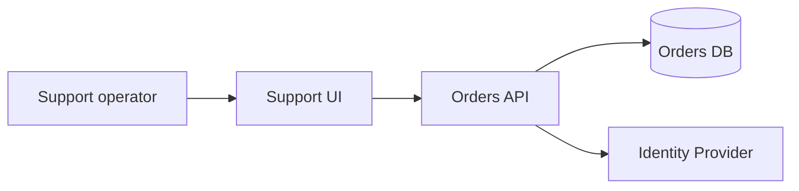

## Architecture Context Map

A questo punto abbiamo abbastanza elementi da rischiare un problema opposto: conoscere molti concetti utili e tenerli separati. System of interest, attori esterni, ownership, dipendenze, critical journey, failure domain, coupling e vincoli hanno valore soltanto se ci aiutano a prendere una decisione concreta.

Per questo introduciamo l'artefatto operativo del capitolo: l'**Architecture Context Map**.

Non è un nuovo standard universale di diagrammazione e non vuole sostituire C4, UML, deployment view o altri modelli esistenti. È un contenitore decision-oriented che ci obbliga a rendere visibile il contesto architetturale necessario prima di scegliere una soluzione.

La domanda a cui deve rispondere è semplice:

> **Che cosa dobbiamo sapere del sistema e del suo ambiente prima di prendere questa decisione?**

## Una mappa costruita per una domanda

Il rischio dei diagrammi di architettura è voler mostrare tutto. Il risultato può essere tecnicamente ricco e cognitivamente povero: una parete di scatole e frecce in cui ogni dettaglio ha lo stesso peso.

Una Context Map efficace parte invece da una domanda. Se stiamo decidendo come rendere più affidabile un journey, ci interesseranno soprattutto dipendenze sincrone, fallback, failure domain e punti in cui la latency si accumula. Se stiamo analizzando security, la stessa realtà verrà osservata attraverso identity, trust boundary, dati sensibili, ingress ed egress. Durante una migration diventeranno centrali consumer, compatibilità, sequencing, ownership e schema evolution.

Il sistema reale non cambia. Cambia ciò che scegliamo di rendere visibile perché cambia la decisione.

> **Un buon diagramma omette intenzionalmente ciò che non serve alla domanda che sta aiutando a risolvere.**

## Struttura minima

Qui ha senso mantenere una struttura esplicita, perché la mappa è un artefatto riutilizzabile e deve poter essere scansionata rapidamente.

```markdown
# Architecture Context Map

## System of interest
Che cosa stiamo progettando o modificando?

## Actors
Chi interagisce con il sistema?

## External systems
Da quali sistemi o capability esterne dipendiamo?

## Responsibilities
Quali responsabilità appartengono al system of interest?

## Data ownership
Quali dati sono autorevoli e dove?

## Critical journeys
Quali comportamenti end-to-end dobbiamo proteggere?

## Dependencies
Quali dipendenze sono obbligatorie e quali opzionali?

## Failure domains
Che cosa può fallire insieme?

## Trust boundaries
Dove cambiano fiducia, identità o privilegi?

## Constraints
Quali vincoli cambiano lo spazio delle opzioni?

## Open questions
Quali informazioni o assunzioni devono ancora essere validate?
```

Non tutte le sezioni hanno lo stesso peso in ogni decisione. Per una modifica piccola possono bastare cinque domande: qual è il system of interest, da cosa dipende, quale journey stiamo proteggendo, dove vive la verità e che cosa può fallire insieme. Per un cambiamento più significativo useremo invece la struttura completa.

## Il diagramma è una parte della mappa, non la mappa

Una rappresentazione molto semplice potrebbe essere:



È utile, ma non ci dice se `Orders DB` sia authoritative per tutti i dati mostrati, quale freshness sia accettabile, che cosa accada quando Identity non risponde o chi possieda il significato dello stato ordine. Le frecce descrivono relazioni; non descrivono automaticamente il contratto di quelle relazioni.

Per questo la Context Map combina una vista visuale, quando serve, con annotazioni decisionali. Il diagramma ci aiuta a vedere la forma. Le annotazioni ci aiutano a capire che cosa quella forma significa.

## Proporzionare l'artefatto alla decisione

La Context Map non deve diventare documentation theater. Non serve una tavola mantenuta ossessivamente per ogni componente e per ogni commit. Possiamo creare una mappa di una pagina per una feature importante, una versione più ricca per un nuovo prodotto, una vista temporanea per analizzare un incidente oppure una mappa living per un dominio complesso.

Il test è lo stesso che abbiamo già applicato agli altri artefatti del libro: **questa rappresentazione modifica o migliora una decisione?** Se richiede tre giorni per documentare una modifica di un'ora, probabilmente la stiamo usando male. Se in mezz'ora rende visibile una dipendenza che avrebbe invalidato il design, ha già prodotto valore.

## Relazione con modelli esistenti

C4 e altri approcci a più livelli di astrazione rimangono strumenti molto utili. Una Context Map può usare un diagramma di contesto, una container view, una deployment view o qualunque notazione aiuti a rispondere alla domanda corrente.

Il punto non è inventare una notazione proprietaria del libro. È separare il mezzo dal reasoning. Una mappa graficamente impeccabile che non chiarisce ownership, vincoli o failure topology può essere poco utile. Una rappresentazione molto semplice che rende evidente una decisione sbagliata può essere architetturalmente preziosa.

## Una mappa come contesto per gli agenti

Questo artefatto diventa particolarmente utile quando deleghiamo lavoro. “Implementa la ricerca ordini” lascia all'agente il compito di ricostruire il sistema implicito attorno alla feature. Se invece forniamo Problem & Outcome Brief, Architecture Context Map, contract rilevanti, acceptance criteria e stop condition, stiamo trasferendo non soltanto il task ma il contesto entro cui quel task deve essere giudicato.

La differenza è importante. Un agente che vede il critical journey sa che ottimizzare una query non basta se la source of truth è sbagliata. Un agente che vede il failure domain può riconoscere che aggiungere una dipendenza sincrona cambia availability e blast radius. Un agente che conosce un'open question può evitare di trasformarla accidentalmente in una decisione implementativa.

### Il rischio della mappa obsoleta

Una Context Map vecchia può essere peggiore dell'assenza di mappa se viene trattata come fonte autorevole. Con gli agenti il problema si amplifica: una rappresentazione obsoleta può essere consumata rapidamente, ripetutamente e con grande fiducia.

Per una mappa living conviene quindi rendere visibili almeno `owner`, `scope`, `last reviewed` e le assunzioni ancora aperte. Non è governance pesante; è un modo per dichiarare quanto possiamo fidarci del documento.

## Il valore reale

L'Architecture Context Map non crea architettura e non prende decisioni al posto nostro. Rende visibile il sistema abbastanza da impedirci di decidere come se il resto non esistesse.

Questa distinzione sarà centrale nei prossimi capitoli. Prima di confrontare pattern, tecnologie o topologie, dobbiamo sapere quali forze stanno realmente agendo sul problema.

> **Prima di ottimizzare una parte, rendi visibile il sistema a cui appartiene.**
