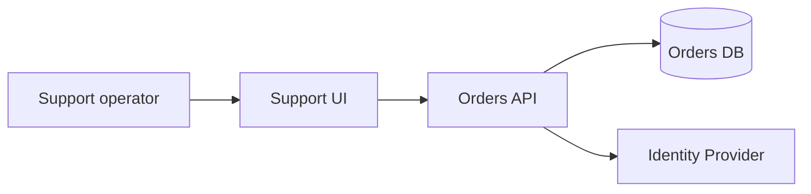

## Architecture Context Map

Finora abbiamo introdotto il system of interest e gli attori esterni, confini, dipendenze e ownership. Abbiamo aggiunto critical user journey, failure domain, coupling e feedback loop. Serve un modo leggero per mettere insieme questi concetti senza trasformarli in nove documenti separati.

L'artefatto operativo di questo capitolo è l'**Architecture Context Map**.

Non è un diagramma standard universale.

È una rappresentazione decision-oriented del contesto architetturale.

Il suo scopo è rispondere a una domanda:

> **Che cosa dobbiamo sapere del sistema e del suo ambiente prima di prendere questa decisione?**

## Struttura minima

Una versione semplice può contenere:

```markdown
# Architecture Context Map

## System of interest
Che cosa stiamo progettando o modificando?

## Actors
Chi interagisce con il sistema?

## External systems
Da quali sistemi esterni dipendiamo?

## Responsibilities
Quali responsabilità appartengono al sistema?

## Data ownership
Quali dati sono autorevoli e dove?

## Critical journeys
Quali flussi end-to-end dobbiamo proteggere?

## Dependencies
Quali dipendenze sono obbligatorie?

## Failure domains
Che cosa può fallire insieme?

## Constraints
Quali vincoli cambiano le opzioni disponibili?

## Open questions
Quali assunzioni devono ancora essere validate?
```

A questo possiamo aggiungere un diagramma.

## Un diagramma utile

Per un sistema piccolo può bastare:



Ma il diagramma da solo non basta.

Non ci dice, per esempio, se `Orders DB` sia authoritative, quanto possa essere vecchio il dato o che cosa accada se Identity non risponde. Non chiarisce chi possieda il significato dello stato ordine né quali vincoli di accesso esistano. Per questo la Context Map unisce rappresentazione e annotazioni decisionali.

## Non è documentation theater

L'Architecture Context Map non deve diventare una tavola da mantenere ossessivamente aggiornata per ogni sistema.

La creiamo quando serve.

Possiamo avere una versione di una pagina per una feature importante.

Una versione più ricca per un nuovo prodotto.

Una mappa temporanea per analizzare un incidente.

Oppure una mappa living per un dominio complesso.

L'artefatto deve essere proporzionato alla decisione.

Se richiede tre giorni per documentare una modifica di un'ora, probabilmente stiamo usando lo strumento male.

## Mappe per domande, non mappe per completezza

Un errore comune nei diagrammi di architettura è voler mostrare tutto.

Il risultato è spesso una parete di scatole e frecce.

Tecnicamente completa.

Cognitivamente inutile.

Una mappa efficace deve avere un punto di vista.

Per esempio:

**Context Map per reliability**

Mostra:

- dipendenze sincrone;
- failure domain;
- fallback;
- critical journey.

**Context Map per security**

Mostra:

- trust boundary;
- identity;
- dati sensibili;
- ingress/egress;
- privilege.

**Context Map per migration**

Mostra:

- consumer;
- schema;
- compatibility;
- ownership;
- sequencing.

La realtà è la stessa.

La vista cambia perché cambia la decisione.

> **Un buon diagramma omette intenzionalmente ciò che non serve alla domanda che sta aiutando a risolvere.**

## Relazione con C4 e altri modelli

Esistono approcci consolidati per rappresentare architetture a più livelli di astrazione.

Possiamo utilizzare diagrammi di contesto, container, componenti, deployment view o altre notazioni quando aiutano.

L'Architecture Context Map non vuole sostituirli.

È un artefatto operativo del libro che può usare quelle rappresentazioni.

Il suo focus non è la notazione.

È il reasoning.

Una mappa disegnata benissimo che non chiarisce ownership, vincoli e failure non ci basta.

Una mappa semplice che fa emergere la decisione giusta può essere molto più utile.

## Context Map come input per agenti

Questo artefatto è particolarmente utile quando deleghiamo lavoro.

Invece di dare a un agente soltanto:

> “Implementa la ricerca ordini.”

possiamo fornire il Problem & Outcome Brief e l'Architecture Context Map, insieme ai contract rilevanti, agli acceptance criteria e alle stop condition. L'agente riceve così non soltanto il compito, ma una rappresentazione del sistema in cui il compito vive.

Questo riduce la probabilità di ottimizzazioni locali incoerenti.

### Ma attenzione alla mappa obsoleta

Una mappa vecchia è peggiore dell'assenza di mappa se viene trattata come fonte autorevole.

Con gli agenti il rischio cresce perché una rappresentazione obsoleta può essere utilizzata ripetutamente e con grande fiducia.

Una Context Map living dovrebbe quindi indicare almeno:

```text
owner
last reviewed
scope
assumptions
```

Non serve una governance pesante.

Serve sapere quando fidarsi.

## Versione lightweight

Per un task medio possiamo usare cinque domande:

```text
1. Qual è il system of interest?
2. Da quali sistemi dipende?
3. Qual è il journey da proteggere?
4. Dove vive la verità?
5. Che cosa può fallire insieme?
```

Queste cinque risposte possono già evitare molti errori.

## Versione standard

Per cambiamenti più importanti:

```text
System of interest
Actors
External systems
Responsibilities
Data ownership
Critical journeys
Dependencies
Failure domains
Trust boundaries
Constraints
Open questions
```

Possiamo aggiungere Mermaid o un diagramma esterno.

## Il valore reale

L'Architecture Context Map non crea architettura.

Rende visibile il contesto in cui l'architettura viene decisa.

Questa distinzione è importante.

Il documento non prende la decisione per noi.

Ci impedisce di prenderla fingendo che il resto del sistema non esista.

> **Prima di ottimizzare una parte, rendi visibile il sistema a cui appartiene.**
