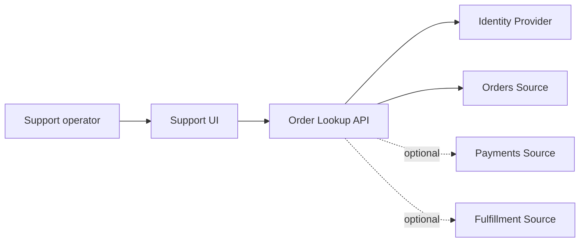

## Acme Orders: dalla feature alla mappa del sistema

Nel Capitolo 1 abbiamo introdotto Acme Orders come caso simulato/composito.

Nel Capitolo 2 abbiamo fermato l'esecuzione e costruito un Problem & Outcome Brief.

Ora possiamo fare il passo successivo.

Non scegliere ancora la soluzione.

Prima rendiamo visibile il sistema.

## System of interest

Per questa iterazione il nostro system of interest è:

```text
Support Order Lookup
```

Non l'intera piattaforma Acme.

Non il payment provider.

Non il warehouse.

Stiamo progettando la capacità che consente a un operatore di supporto autorizzato di trovare un ordine e comprenderne lo stato corrente abbastanza rapidamente da rispondere a un cliente.

Questo confine è intenzionale.

## Actors

Gli attori principali sono:

```text
Support operator
Customer indirettamente, attraverso il supporto
Platform operator durante incidenti
```

Il support operator è l'utente diretto.

Il customer riceve il valore finale.

Il platform operator diventa importante quando il journey degrada e dobbiamo capire perché.

## External systems

La capacità dipende almeno da:

```text
Identity Provider
Order source of truth
Customer data source
```

A seconda del significato che vogliamo attribuire allo stato ordine, potrebbe dipendere anche da:

```text
Payment system
Warehouse/Fulfillment system
```

Ed è qui che emerge una decisione importante.

Se il supporto deve vedere un unico `status`, chi lo calcola?

Se invece mostriamo separatamente:

```text
Order status
Payment status
Fulfillment status
```

stiamo rappresentando il dominio in modo diverso.

Il requisito “mostra lo stato ordine” nascondeva questa scelta.

## Data ownership

Proviamo a rendere esplicita l'ownership.

```text
Order identity       → Orders
Order lifecycle      → Orders
Payment state        → Payments
Fulfillment state    → Fulfillment
Customer identity    → Customer/Identity domain
```

La UI non possiede nessuna di queste verità.

Il support service, se introdotto, non dovrebbe diventare autorevole accidentalmente soltanto perché aggrega i dati.

Se usiamo una proiezione o un read model, dovremo distinguere:

```text
authoritative source
vs
query-optimized representation
```

Questa distinzione diventerà fondamentale quando parleremo di dati e consistency.

## Critical user journey

Il journey principale è:

```text
Support operator authenticates
        ↓
Searches by order identifier
        ↓
System validates authorization
        ↓
Retrieves order information
        ↓
Shows state + relevant timestamps
        ↓
Operator judges what to tell customer
```

Gli acceptance criteria del capitolo precedente ci obbligano a considerare anche:

- ordine inesistente;
- ordine non accessibile;
- dato temporaneamente non disponibile;
- dato potenzialmente stale;
- dipendenza in timeout.

Questi non sono dettagli di UI.

Sono stati del journey.

## Prima mappa

Una rappresentazione iniziale potrebbe essere:



Le linee tratteggiate sono volutamente ancora una domanda.

Dobbiamo decidere se il journey richiede chiamate live a quei sistemi, una proiezione, oppure dati già posseduti dal dominio ordini.

La mappa espone l'incertezza invece di nasconderla.

## Dipendenze sincrone: una scelta, non un destino

Potremmo implementare il lookup chiamando live tutti i sistemi.

```text
Lookup
→ Orders
→ Payments
→ Fulfillment
```

Vantaggio:

potremmo ottenere dati molto freschi.

Costo:

la disponibilità e latency del journey dipenderebbero da tutte le dipendenze obbligatorie.

Oppure potremmo costruire un read model.

```text
Orders ─┐
Payments ├→ events → Support Read Model
Fulfillment ─┘
```

Vantaggio:

query semplice e isolamento dalle dipendenze live.

Costo:

introduciamo replication, lag, rebuild, event processing e problemi di consistency.

Notiamo il punto fondamentale.

Non stiamo ancora scegliendo.

Ma ora sappiamo **che cosa stiamo pagando in ciascuna direzione**.

Questo è pensiero architetturale.

## Failure domain

Con una strategia live, alcuni failure mode sono:

```text
Identity unavailable
Orders unavailable
Payment unavailable
Fulfillment unavailable
Network degradation
Timeout accumulation
```

Con un read model:

```text
Projection storage unavailable
Consumer stopped
Event lost or delayed
Projection lag
Schema incompatibility
Rebuild failure
```

Non esiste la soluzione senza failure.

Esiste una scelta tra failure topology differenti.

## Freshness

Il brief ci ha dato una domanda cruciale:

> quanto può essere vecchio il dato prima di diventare inutilizzabile per il supporto?

Supponiamo che il business dica:

> “Per la maggior parte delle richieste, un ritardo di alcuni secondi è accettabile; per stati di pagamento e annullamento dobbiamo mostrare chiaramente l'ultimo aggiornamento noto.”

Questa informazione cambia enormemente lo spazio delle soluzioni.

Un requisito di freshness non è un dettaglio tecnico.

È un input architetturale.

## Trust boundary

Il supporto vede dati dei clienti.

Quindi dobbiamo almeno rappresentare:

```text
Support operator
→ authenticated internal application
→ authorization boundary
→ customer/order data
```

Non basta che l'utente sia autenticato.

Dobbiamo chiedere:

- quali ordini può vedere?
- quali dati personali sono necessari?
- dobbiamo auditare le consultazioni?
- esistono ruoli differenti nel supporto?

Queste domande verranno approfondite nel capitolo security.

Ma la Context Map deve renderle visibili già adesso.

## Open questions

La nostra prima mappa produce un backlog di decisioni:

1. Che cosa significa esattamente `order status`?
2. Orders possiede anche una rappresentazione sufficiente di payment e fulfillment?
3. Qual è la freshness accettabile?
4. Il supporto necessita dato live o “ultimo stato noto + timestamp”?
5. Quali dipendenze devono essere obbligatorie nel request path?
6. Che cosa mostriamo durante un degrado parziale?
7. Serve audit degli accessi?
8. Qual è il volume atteso delle ricerche?
9. Quali lookup key supportiamo?
10. Quali informazioni sono considerate sensibili?

Queste domande sono un risultato utile.

Non rappresentano incompletezza del lavoro.

Rappresentano complessità che prima era nascosta.

## Che cosa abbiamo ottenuto

Non abbiamo ancora scelto:

- database;
- cache;
- queue;
- microservizio;
- serverless;
- cloud service;
- event broker.

Eppure sappiamo molto di più sull'architettura.

Abbiamo identificato:

- il system of interest;
- gli attori;
- le fonti autorevoli;
- le dipendenze;
- il journey critico;
- il trust boundary;
- i failure domain;
- le domande che cambieranno la soluzione.

Questo è il punto dell'Architecture Context Map.

> **Prima di scegliere i componenti, rendiamo visibili le forze che dovranno governarli.**
