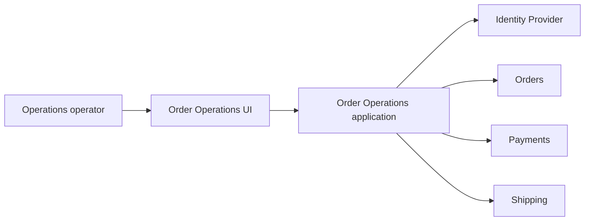

## Order Operations: dalla feature alla mappa del sistema

Nel Capitolo 1 abbiamo introdotto Order Operations dentro Example Software Industries S.p.A. Nel Capitolo 2 abbiamo fermato l'execution abbastanza a lungo da scrivere un Problem & Outcome Brief. Ora facciamo il passo successivo: prima di scegliere la soluzione, rendiamo visibile il sistema dentro cui quella soluzione dovrà funzionare.

## Il system of interest

Per questa iterazione non stiamo progettando l'intera piattaforma ESI, il dominio Commerce completo o il payment provider. Il nostro **system of interest** è più ristretto: la capacità che permette a un operatore autorizzato di trovare un ordine problematico, comprenderne lo stato e decidere se intervenire, attendere o escalare.

Possiamo chiamarla:

```text
Operational Order Investigation
```

Il nome conta meno del confine. Stiamo scegliendo deliberatamente che cosa osservare e, di conseguenza, quali relazioni devono diventare visibili.

## Chi partecipa al comportamento

L'Operations Operator è l'utente diretto. L'Operations Supervisor condivide gran parte del journey, ma osserva anche distribuzione e anzianità dei casi. Il cliente non usa questa capability nella prima iterazione, eppure riceve il valore finale quando il problema viene individuato e gestito correttamente. Durante un degrado entra in scena anche il Platform Operator, perché il journey deve essere diagnosticabile. Payments & Risk diventa invece stakeholder quando il significato di un dato o una futura azione tocca il dominio economico.

Questa distinzione è già utile: il sistema non coincide con chi clicca l'interfaccia. Include anche gli attori che possiedono decisioni necessarie al comportamento.

## Le fonti che Order Operations non possiede

La vista operativa attraversa più ownership. L'identità dell'operatore appartiene alla capability di Identity; il lifecycle commerciale dell'ordine appartiene a Orders; lo stato economico appartiene a Payments; lo stato della spedizione appartiene a Shipping. Order Operations può derivare una **problem category**, ma quella derivazione non deve trasformarsi accidentalmente nella nuova verità commerciale dell'ordine.

La mappa dell'ownership può essere rappresentata così:

```text
Order identity       → Orders
Order lifecycle      → Orders
Payment state        → Payments
Shipment state       → Shipping
Operator identity    → Identity
Problem category     → Order Operations, come derivazione operativa
```

La UI non possiede nessuna di queste verità soltanto perché le mostra. Anche se in futuro introducessimo una proiezione o un read model, dovremmo continuare a distinguere tra **authoritative source** e **query-optimized representation**.

Questa separazione evita una scorciatoia molto comune: confondere il luogo più comodo da leggere con il luogo che possiede il significato.

## Il critical journey

Il journey principale parte da un'intenzione semplice: un operatore vuole capire che cosa sta succedendo a un ordine problematico. Per riuscirci deve autenticarsi, aprire la vista, superare l'autorizzazione, ottenere i dati necessari e riceverli in una forma che distingua ordine, pagamento, spedizione, categoria operativa e freshness.

```text
Operations operator authenticates
        ↓
Opens problematic orders view
        ↓
System validates authorization
        ↓
Retrieves required operational data
        ↓
Shows Order + Payment + Shipment state
        ↓
Shows known problem category and timestamps
        ↓
Operator judges Action / Wait / Escalation
```

Questa sequenza rende subito più povera la richiesta iniziale “costruiamo una dashboard”. La dashboard è soltanto una superficie. Il comportamento reale include autorizzazione, ownership dei dati, qualità dell'informazione e stati di degrado.

Gli acceptance criteria del capitolo precedente ci obbligano infatti a distinguere casi molto diversi: ordine inesistente, ordine esistente ma non accessibile, Payment temporaneamente non disponibile, Shipping degradato, dato potenzialmente stale, timeout o combinazioni di stati formalmente valide ma semanticamente sospette. Questi non sono dettagli di interfaccia. Sono stati possibili del journey.

## La prima mappa

Una vista iniziale può rimanere intenzionalmente semplice:



La mappa non decide ancora come recuperiamo i dati. Payments e Shipping potrebbero essere interrogati live, rappresentati tramite proiezioni o raggiunti attraverso contratti interni differenti. Questa incertezza non è un difetto del diagramma: è una decisione ancora aperta che il diagramma rende visibile.

## Due direzioni architetturali, due costi diversi

Una prima possibilità sarebbe comporre la vista interrogando live le fonti necessarie:

```text
Order Operations
→ Orders
→ Payments
→ Shipping
```

Il vantaggio è intuitivo: potremmo ottenere dati molto freschi senza introdurre una copia operativa persistente. Il costo è altrettanto reale: availability e latency del journey diventano dipendenti dalla salute delle fonti obbligatorie e dal modo in cui reagiamo a timeout e degradi parziali.

Un'altra possibilità sarebbe costruire un read model aggiornato asincronamente:

```text
Orders ─┐
Payments ├→ events → Operational Read Model
Shipping ─┘
```

In questo caso la query operativa può diventare più semplice e il request path può essere più isolato dalle dipendenze live. In cambio introduciamo replication, lag, consumer, rebuild, gestione degli eventi e nuovi problemi di consistency.

Non stiamo ancora scegliendo. La Context Map ci permette però di formulare correttamente il tradeoff: non “live è semplice” contro “event-driven è moderno”, ma **freshness e dipendenze sincrone** contro **replica, lag e complessità operativa**.

## Il contrasto aziendale entra nella mappa

Commerce & Operations vorrebbe una vista sempre completa. Platform Engineering osserva che rendere obbligatorie molte dipendenze nel request path aumenta failure surface e costo operativo. Payments & Risk non vuole che una cache o una proiezione presenti dati economici vecchi come se fossero certamente attuali.

Le tre esigenze sono legittime e non possono essere massimizzate contemporaneamente senza costo. Il compromesso del capitolo consiste quindi nel **non scegliere ancora** live lookup o read model, perché ci manca una parte dell'informazione necessaria per farlo responsabilmente.

Accettiamo il costo di rinviare una decisione tecnica reversibile. Non accettiamo invece che un dato stale venga mostrato come certamente attuale, né che una rappresentazione derivata diventi source of truth per inerzia. I guardrail sono già visibili: ownership documentata, timestamp/freshness esplicita e Architecture Context Map come contesto della decisione.

Anche rinviare una scelta può essere una buona decisione quando è chiaro che cosa manca per prenderla meglio.

## La topologia del failure cambia con la soluzione

Con una strategia live, Identity, Orders, Payments, Shipping e il percorso di rete possono entrare direttamente nel failure domain del journey. I timeout possono accumularsi e una singola dipendenza degradata può rendere incompleta la vista.

Con un read model, una parte di quei failure si sposta altrove: consumer fermo, evento in ritardo, proiezione stale, incompatibilità di schema, storage indisponibile o rebuild fallito. Il sistema può risultare disponibile dal punto di vista della query e comunque mostrare dati non abbastanza freschi per la decisione operativa.

Non esiste la variante “senza failure”. Esistono **failure topology differenti** e dobbiamo capire quale sia più compatibile con l'outcome.

## Freshness come requisito architetturale

Il brief ci ha lasciato una domanda decisiva: quanto può essere vecchio il dato prima di diventare inutile o pericoloso per Operations?

Se il business ci dicesse che un ritardo breve è accettabile per alcune informazioni, ma che payment e cancellation devono mostrare chiaramente l'ultimo aggiornamento noto, avremmo già ristretto in modo significativo lo spazio delle soluzioni. Potremmo ammettere dati derivati, purché la loro età sia osservabile; potremmo trattare diversamente campi con criticità differenti.

Il target di freshness non è quindi una finezza tecnica. È un input architetturale perché decide quali forme di replica, caching e degradazione sono compatibili con il comportamento atteso.

## Trust boundary

Order Operations espone dati relativi ai clienti a operatori interni. L'autenticazione da sola non basta. Dobbiamo sapere quali ordini può vedere un operatore, quali dati personali sono davvero necessari, se le consultazioni devono essere auditabili e quali azioni future richiederanno privilegi più forti.

La Context Map non risolve ancora queste domande, che approfondiremo nel capitolo sulla security. Le rende però impossibili da dimenticare mentre discutiamo la soluzione tecnica.

## Le domande che la mappa ha fatto emergere

A questo punto sappiamo che la definizione di `problematic order` deve essere condivisa, che la freshness può variare per tipo di dato, che non abbiamo ancora deciso quali dipendenze debbano vivere nel request path e che il comportamento durante un degrado parziale deve essere esplicito. Dobbiamo inoltre capire se serve audit degli accessi, quale volume attendiamo, quali informazioni sono sensibili e quali decisioni richiederanno il coinvolgimento di Payments & Risk o Security.

Queste domande non rappresentano un'analisi fallita. Sono complessità che prima erano nascoste dentro la parola “dashboard”.

## Che cosa abbiamo ottenuto

Non abbiamo ancora scelto database, cache, queue, broker, microservizi, serverless o cloud service. Eppure l'architettura è già più comprensibile. Abbiamo delimitato il system of interest, identificato attori e ownership, reso visibile il journey critico, riconosciuto trust boundary e failure topology e soprattutto separato ciò che sappiamo dalle decisioni ancora aperte.

Questo è il valore della Context Map:

> **Prima di scegliere i componenti, rendiamo visibili le forze che dovranno governarli.**
