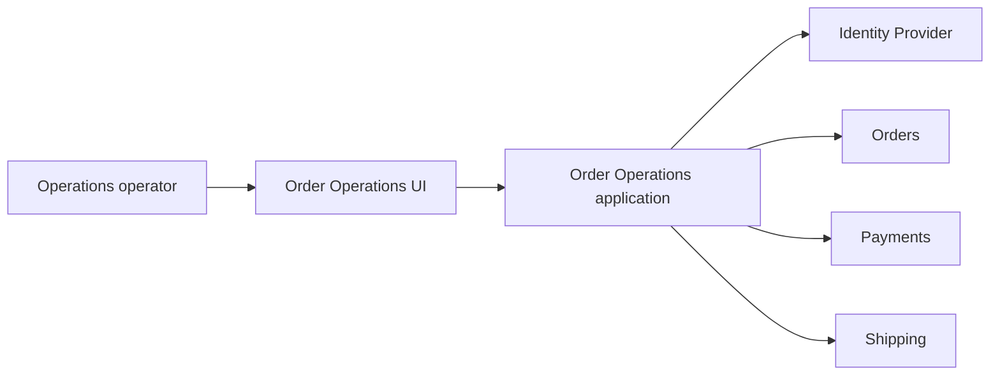

## Order Operations: dalla feature alla mappa del sistema

Nel Capitolo 1 abbiamo introdotto Order Operations dentro Example Software Industries S.p.A.

Nel Capitolo 2 abbiamo fermato l'execution e costruito un Problem & Outcome Brief.

Ora possiamo fare il passo successivo.

Non scegliere ancora la soluzione.

Prima rendiamo visibile il sistema.

## System of interest

Per questa iterazione il nostro system of interest è:

```text
Operational Order Investigation
```

Non l'intera piattaforma ESI.

Non l'intero dominio Commerce.

Non il payment provider.

Non il sistema di shipping.

Stiamo progettando la capacità che consente a un operatore autorizzato di trovare un ordine problematico e comprenderne lo stato abbastanza bene da decidere se intervenire, attendere o escalare.

Questo confine è intenzionale.

## Actors

Gli attori principali sono:

```text
Operations Operator
Operations Supervisor
Customer indirettamente
Platform Operator durante incidenti
Payments & Risk come stakeholder di dominio
```

L'Operations Operator è l'utente diretto.

Il Customer riceve il valore finale quando il problema viene risolto correttamente e in tempo.

Il Platform Operator diventa importante quando il journey degrada e dobbiamo capire perché.

Payments & Risk entra quando il significato di un dato o una futura azione tocca il dominio economico.

## External systems e domini adiacenti

La capacità dipende almeno da:

```text
Identity Provider
Orders source of truth
Payments source of truth
Shipping source of truth
```

A seconda di come evolverà ESI, alcune di queste capability potrebbero essere moduli interni, servizi separati o integrazioni verso provider esterni.

Per il system thinking di questo capitolo la topologia concreta non è ancora il punto principale.

Il punto è che la nostra vista attraversa più ownership.

Se Order Operations mostra un unico `status`, chi lo calcola?

Se invece mostra separatamente:

```text
Order status
Payment status
Shipment status
Problem category
```

stiamo rappresentando il dominio in modo diverso.

Il requisito “mostra lo stato dell'ordine” nascondeva questa scelta.

## Data ownership

Rendiamo esplicita l'ownership.

```text
Order identity       → Orders
Order lifecycle      → Orders
Payment state        → Payments
Shipment state       → Shipping
Operator identity    → Identity
Problem category     → Order Operations, come derivazione operativa
```

La UI non possiede nessuna di queste verità soltanto perché le mostra.

Order Operations non dovrebbe diventare autorevole accidentalmente soltanto perché aggrega i dati.

Se useremo una proiezione o un read model, dovremo distinguere:

```text
authoritative source
vs
query-optimized representation
```

Questa distinzione diventerà fondamentale quando parleremo di dati e consistency.

## Critical user journey

Il journey principale è:

```text
Operations operator authenticates
        ↓
Opens problematic orders view
        ↓
System validates authorization
        ↓
Retrieves required operational data
        ↓
Shows Order + Payment + Shipment state
        ↓
Shows known problem category and timestamps
        ↓
Operator judges Action / Wait / Escalation
```

Gli acceptance criteria del capitolo precedente ci obbligano a considerare anche:

- ordine inesistente;
- ordine non accessibile;
- pagamento temporaneamente non disponibile;
- shipping temporaneamente non disponibile;
- dato potenzialmente stale;
- dipendenza in timeout;
- combinazione di stati formalmente valida ma semanticamente sospetta.

Questi non sono dettagli di UI.

Sono stati del journey.

## Prima mappa

Una rappresentazione iniziale potrebbe essere:



La mappa non ci dice ancora se Payments e Shipping vengono interrogati live, letti tramite proiezione o raggiunti attraverso contratti interni.

Quella è ancora una decisione.

La mappa espone l'incertezza invece di nasconderla.

## Dipendenze sincrone: una scelta, non un destino

Potremmo implementare la vista chiamando live tutte le fonti.

```text
Order Operations
→ Orders
→ Payments
→ Shipping
```

Vantaggio:

potremmo ottenere dati molto freschi.

Costo:

availability e latency del journey dipenderebbero dalle dipendenze obbligatorie.

Oppure potremmo costruire un read model.

```text
Orders ─┐
Payments ├→ events → Operational Read Model
Shipping ─┘
```

Vantaggio:

query semplice e maggiore isolamento dalle dipendenze live.

Costo:

introduciamo replication, lag, rebuild, event processing e nuovi problemi di consistency.

Non stiamo ancora scegliendo.

Ma ora sappiamo **che cosa stiamo pagando in ciascuna direzione**.

Questo è pensiero architetturale.

## Il contrasto aziendale del capitolo

Commerce & Operations vorrebbe una vista sempre completa.

Platform Engineering osserva che rendere obbligatorie tutte le dipendenze nel request path può aumentare failure surface e costo operativo.

Payments & Risk non vuole che una cache o proiezione trasformi dati economici stale in una decisione apparentemente certa.

Le tre richieste sono legittime.

Non possiamo massimizzarle tutte contemporaneamente senza costo.

## Il compromesso

**Esigenza**

Dare all'operatore una vista utile e comprensibile.

**Tensione**

Freshness e completezza contro availability, latency e semplicità operativa.

**Decisione attuale**

Non scegliamo ancora live lookup o read model. Rendiamo prima esplicite dipendenze, ownership e qualità necessarie per decidere nel capitolo successivo.

**Costo accettato**

Rinviamo una decisione tecnica che potremmo implementare subito.

**Quality floor**

Non accettiamo che un dato stale venga presentato come certamente attuale e non accettiamo che una proiezione diventi source of truth accidentalmente.

**Guardrail**

Architecture Context Map, timestamp/freshness esplicita e ownership documentata.

Anche **rinviare una decisione** può essere un compromesso ben progettato quando la decisione è reversibile e manca ancora informazione significativa.

## Failure domain

Con una strategia live, alcuni failure mode sono:

```text
Identity unavailable
Orders unavailable
Payments unavailable
Shipping unavailable
Network degradation
Timeout accumulation
```

Con un read model:

```text
Projection storage unavailable
Consumer stopped
Event lost or delayed
Projection lag
Schema incompatibility
Rebuild failure
```

Non esiste la soluzione senza failure.

Esiste una scelta tra failure topology differenti.

## Freshness

Il brief ci ha dato una domanda cruciale:

> quanto può essere vecchio il dato prima di diventare inutilizzabile per Operations?

Supponiamo che il business dica:

> “Per alcune informazioni un breve ritardo è accettabile; per payment e cancellation dobbiamo mostrare chiaramente l'ultimo aggiornamento noto.”

Questa informazione cambia enormemente lo spazio delle soluzioni.

Un requisito di freshness non è un dettaglio tecnico.

È un input architetturale.

## Trust boundary

Operations vede dati dei clienti.

Quindi dobbiamo almeno rappresentare:

```text
Operations operator
→ authenticated internal application
→ authorization boundary
→ customer/order data
```

Non basta che l'utente sia autenticato.

Dobbiamo chiedere:

- quali ordini può vedere?
- quali dati personali sono necessari?
- dobbiamo auditare le consultazioni?
- esistono ruoli differenti?
- quali azioni future richiederanno privilegi più forti?

Queste domande verranno approfondite nel capitolo security.

Ma la Context Map deve renderle visibili già adesso.

## Open questions

La nostra prima mappa produce un backlog di decisioni:

1. Che cosa significa esattamente `problematic order`?
2. Qual è la freshness accettabile per ciascun tipo di dato?
3. L'operatore necessita dato live o “ultimo stato noto + timestamp”?
4. Quali dipendenze devono essere obbligatorie nel request path?
5. Che cosa mostriamo durante un degrado parziale?
6. Serve audit degli accessi?
7. Qual è il volume atteso delle ricerche?
8. Quali informazioni sono considerate sensibili?
9. Quali policy sono locali a Commerce & Operations e quali sono aziendali?
10. Quali decisioni future richiederanno Payments & Risk o Security al tavolo?

Queste domande sono un risultato utile.

Non rappresentano incompletezza del lavoro.

Rappresentano complessità che prima era nascosta.

## Che cosa abbiamo ottenuto

Non abbiamo ancora scelto:

- database;
- cache;
- queue;
- microservizio;
- serverless;
- cloud service;
- event broker.

Eppure sappiamo molto di più sull'architettura.

Abbiamo identificato:

- il system of interest;
- gli attori;
- le fonti autorevoli;
- le dipendenze;
- il journey critico;
- il trust boundary;
- i failure domain;
- gli stakeholder aziendali;
- le domande che cambieranno la soluzione.

Questo è il punto dell'Architecture Context Map.

> **Prima di scegliere i componenti, rendiamo visibili le forze che dovranno governarli.**