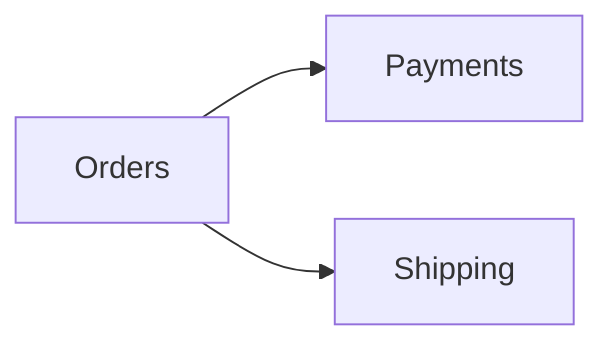
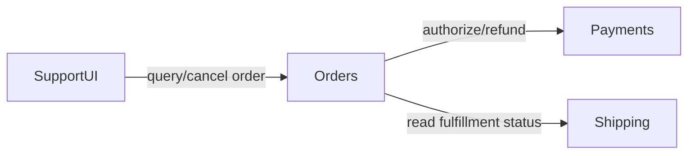

## Component Responsibility Map

Abbiamo usato cohesion, coupling, information hiding, dependency direction, ownership e linguaggio del dominio come segnali per giudicare i confini. Ora ci serve un artefatto che renda visibili queste decisioni senza trasformare il design in un inventario di classi.

Lo chiameremo **Component Responsibility Map**.

Il suo obiettivo è semplice:

> **rendere esplicito chi è responsabile di che cosa, che cosa nasconde e attraverso quali contratti collabora con il resto del sistema.**

## “Component” non significa necessariamente servizio

In questa mappa un component è una **unità significativa di responsabilità** al livello di dettaglio utile per la decisione corrente. In un monolite può corrispondere a un modulo, in un sistema distribuito a un servizio, in un caso più piccolo a una singola capability.

Il livello non va scelto per uniformità estetica. Deve essere coerente con la domanda che stiamo cercando di risolvere.

## Struttura base

Qui la forma strutturata è intenzionale perché il risultato deve essere confrontabile e riutilizzabile:

```text
Component:

Responsabilità:

È autorevole su:

Invarianti principali:

Espone:

Nasconde:

Dipende da:

Non deve conoscere:

Failure rilevanti:

Ragioni tipiche di cambiamento:
```

Non tutti i campi devono essere compilati sempre. La mappa deve restare proporzionata al rischio e alla complessità del boundary.

Un esempio minimale per Orders potrebbe essere:

```text
Component: Orders

Responsabilità:
- lifecycle dell'ordine
- regole di cancellazione
- stato commerciale dell'ordine

È autorevole su:
- Order
- OrderStatus

Espone:
- query stato ordine
- capability di cancellazione

Nasconde:
- schema di persistenza
- mapping interno degli stati

Dipende da:
- Payment capability
- Shipping status capability

Non deve conoscere:
- SDK del payment provider
- tabelle interne di Shipping
```

La mappa non decide automaticamente se Orders debba essere una libreria, un modulo o un servizio. Rende però discutibile la sua responsabilità.

## Le relazioni devono spiegare il motivo

Un diagramma che mostra soltanto:



ci dice che esiste una dipendenza, ma non il suo significato. Possiamo renderla più utile:



La label della relazione spesso contiene più informazione architetturale della freccia stessa, perché ci permette di chiedere se quella dipendenza appartenga davvero al consumer e quale contratto debba proteggerla.

## Trovare overlap, gap e leak

Una Responsibility Map è particolarmente utile quando rivela che più componenti stanno rivendicando la stessa regola. Se Orders decide se l'ordine è cancellabile, Shipping prende una decisione equivalente e la UI ricostruisce la condizione per mostrare il pulsante, abbiamo probabilmente **duplicate meaning**.

La UI può usare il risultato della policy per scegliere la presentazione. Non dovrebbe necessariamente reimplementare il significato.

Il problema opposto è il **gap**: un comportamento importante esiste, ma nessun component ne sembra proprietario. In quel caso la regola tende a finire in controller, script, query o pipeline e diventa architettura accidentale.

Esiste poi il **leak**: la responsabilità è apparentemente chiara, ma i consumer continuano a conoscere dettagli che il component dovrebbe nascondere.

La mappa rende questi tre problemi visibili senza prescrivere automaticamente la soluzione.

## Un component molto grande non implica sette servizi

Se una singola voce dichiara di possedere utenti, ordini, pagamenti, notifiche, reporting, permissions ed export, abbiamo un segnale di cohesion debole. Non significa che dobbiamo creare sette microservizi.

Significa che vale la pena verificare se le ragioni di cambiamento siano davvero condivise o se il component sia diventato il contenitore di tutto ciò che non ha ancora un boundary esplicito.

La mappa apre la discussione. Non la chiude.

## Lightweight e high-risk

Per sistemi piccoli può bastare una tabella:

| Component | Owns | Exposes | Depends on |
|---|---|---|---|
| Orders | lifecycle ordine | query, cancel | Payments, Shipping |
| Payments | transazioni pagamento | authorize, refund | Provider |
| Shipping | fulfillment | status | Carrier |

Per un sistema ad alto rischio possiamo aggiungere owner team, security boundary, data classification, SLO, failure isolation, deployment unit, recovery expectation e compliance constraint.

È sempre lo stesso artefatto. Aumenta la profondità dove il rischio lo giustifica.

## As-is e to-be non sono la stessa mappa

La Component Responsibility Map può descrivere il sistema corrente oppure la struttura desiderata. Le due viste non vanno confuse.

Una mappa **as-is** serve a capire dove sono oggi ownership, overlap e leak. Una mappa **to-be** rende esplicita la direzione del refactoring. Se rappresentiamo il to-be come se fosse già reale, perdiamo capacità diagnostica; se documentiamo soltanto l'as-is, rischiamo di descrivere il problema senza progettare il cambiamento.

Quando la differenza è importante, manteniamo entrambe.

## Uso operativo con gli agenti

Una Responsibility Map può diventare contesto di delega. Un agente che lavora su Orders può sapere quali directory può modificare, quali capability può consumare e quali accessi rappresentano una violazione del boundary.

Per esempio:

```text
puoi modificare:
- orders/**

puoi usare:
- PaymentGateway
- FulfillmentStatusReader

non puoi:
- leggere direttamente shipping tables
- importare provider SDK nel dominio
- ridefinire cancellation rules nella UI
```

Il documento non sostituisce enforcement e test. Rende però il perimetro abbastanza preciso da poter essere trasformato, dove possibile, in guardrail automatici.

> **Un confine utile è quello che può essere spiegato, usato e verificato.**
