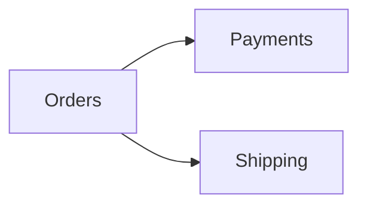
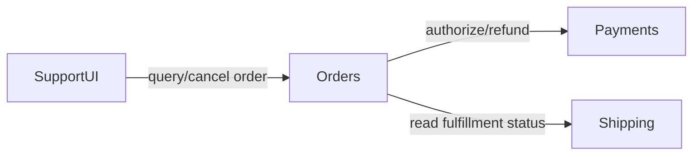

## Component Responsibility Map

Finora abbiamo usato ragioni di cambiamento, cohesion e coupling, information hiding e dependency direction, ownership e linguaggio del dominio come segnali per giudicare i confini. Serve ora un artefatto che li renda visibili senza trasformare il design in un inventario di classi.

Lo chiameremo:

## Component Responsibility Map

L'obiettivo è semplice:

> **rendere esplicito chi è responsabile di che cosa, che cosa nasconde e attraverso quali contratti collabora con il resto del sistema.**

### Che cos'è un component in questa mappa

“Component” qui non indica necessariamente un microservizio o un processo, un package, una libreria o un container. Indica una **unità significativa di responsabilità** al livello di dettaglio che ci serve per prendere una decisione.

In un monolite potrebbe corrispondere a un modulo.

In un sistema distribuito potrebbe coincidere con un servizio.

In un caso più piccolo potrebbe essere una singola capability.

Il livello deve essere coerente con la domanda che stiamo cercando di risolvere.

### Struttura base

Per ogni componente possiamo descrivere:

```text
Component:

Responsabilità:

È autorevole su:

Invarianti principali:

Espone:

Nasconde:

Dipende da:

Non deve conoscere:

Failure rilevanti:

Ragioni tipiche di cambiamento:
```

Non tutti i campi sono obbligatori per ogni progetto.

L'artefatto deve restare proporzionato.

### Esempio minimale

```text
Component: Orders

Responsabilità:
- lifecycle dell'ordine
- regole di cancellazione
- stato commerciale dell'ordine

È autorevole su:
- Order
- OrderStatus

Espone:
- query stato ordine
- capability di cancellazione

Nasconde:
- schema di persistenza
- mapping interno degli stati

Dipende da:
- Payment authorization/refund capability
- Shipping status capability

Non deve conoscere:
- SDK del payment provider
- tabelle interne di Shipping
```

Già questa forma costringe a fare domande utili.

### Le frecce devono avere significato

Se aggiungiamo un diagramma, non vogliamo soltanto:



Vogliamo sapere **perché**.

Per esempio:



La label della relazione spesso contiene più informazione architetturale della freccia stessa.

### Responsibility overlap

Una delle funzioni migliori della mappa è trovare sovrapposizioni.

Supponiamo di avere:

```text
Orders
- decide se un ordine è cancellabile

SupportPortal
- decide se mostrare il pulsante Cancel

Shipping
- decide se l'ordine è ancora cancellabile
```

Tre componenti dichiarano implicitamente ownership della stessa regola.

È un segnale di duplicate meaning.

La UI può ovviamente usare la regola per decidere che cosa mostrare.

Ma dovrebbe idealmente ricevere il risultato da una fonte autorevole, non reimplementarne la semantica.

### Missing responsibility

La mappa trova anche il problema opposto.

Se esiste un comportamento importante ma nessun componente sembra possederlo, probabilmente quella regola finirà in un controller, in uno script, in una query o in una pipeline, oppure verrà duplicata fra consumer diversi. Questa è una forma comune di architettura accidentale.

### Too many responsibilities

Se una singola voce contiene:

```text
Users
Orders
Payments
Notifications
Reporting
Permissions
Exports
```

non significa automaticamente che servano sette servizi.

Significa però che dobbiamo verificare se quel componente è davvero coeso o se è semplicemente diventato il posto in cui vive tutto.

La mappa serve a rendere il problema discutibile.

### Versione lightweight

Per sistemi piccoli può bastare una tabella:

| Component | Owns | Exposes | Depends on |
|---|---|---|---|
| Orders | lifecycle ordine | query, cancel | Payments, Shipping |
| Payments | transazioni pagamento | authorize, refund | Provider |
| Shipping | fulfillment | status | Carrier |

È spesso sufficiente.

### Versione high-risk

Per sistemi critici possiamo aggiungere security boundary e data classification, SLO e owner team, deployment unit, failure isolation e recovery expectation, fino ai compliance constraint rilevanti. Non è un altro artefatto obbligatorio.

È lo stesso artefatto con più profondità dove il rischio lo richiede.

### Non disegnare il codice corrente per forza

La mappa può avere due usi differenti:

**As-is** — capire come le responsabilità sono distribuite oggi.

**To-be** — rendere esplicita una direzione desiderata.

Non vanno confuse.

Se disegniamo il to-be come se fosse già reale, perdiamo capacità diagnostica.

Se disegniamo soltanto l'as-is, rischiamo di documentare il problema senza progettare il cambiamento.

Quando serve, manteniamo entrambe.

### Uso con gli agenti

Una Component Responsibility Map può diventare contesto operativo.

Un agente che riceve un task su Orders può sapere:

```text
puoi modificare:
- orders/**

puoi usare:
- PaymentGateway
- FulfillmentStatusReader

non puoi:
- leggere direttamente shipping tables
- importare provider SDK nel dominio
- ridefinire cancellation rules nella UI
```

Il documento non sostituisce test e enforcement.

Ma rende la delega molto più precisa.

> **Un confine utile è quello che può essere spiegato, usato e verificato.**

La mappa serve esattamente a questo.
