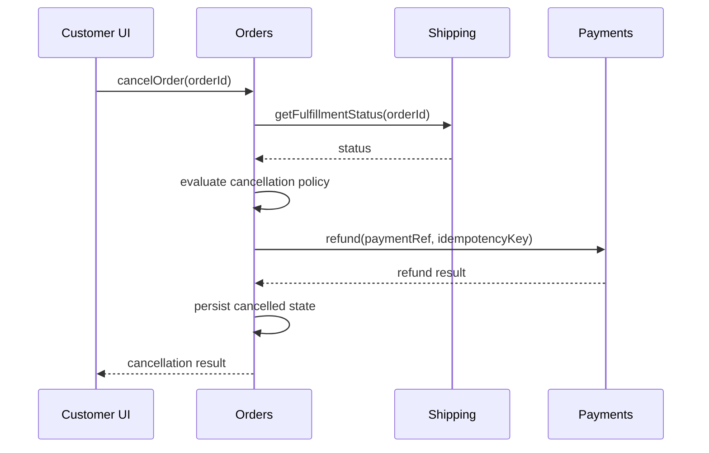

## Acme Orders — dai file alle responsabilità

> **Caso simulato/composito.** Acme Orders è il capstone didattico del libro. Nomi, numeri e circostanze sono costruiti per mostrare problemi realistici, non descrivono una specifica azienda reale.

Nel capitolo precedente avevamo deciso di mantenere, per ora, un lookup live sul database operativo.

Quella decisione rispondeva a una domanda architetturale precisa.

Ma non ci dice ancora come strutturare il software.

Supponiamo che il prototipo iniziale abbia questa forma:

```text
src/
  controllers/
    orders.ts
  services/
    orders.ts
    email.ts
  repositories/
    orders.ts
    payments.ts
    shipping.ts
  models/
    order.ts
    payment.ts
    shipment.ts
  utils/
    dates.ts
    status.ts
```

Funziona.

Ma per aggiungere l'annullamento dell'ordine scopriamo che dobbiamo modificare:

```text
controllers/orders.ts
services/orders.ts
repositories/orders.ts
repositories/payments.ts
repositories/shipping.ts
utils/status.ts
```

e probabilmente anche il frontend.

La struttura tecnica non ci sta aiutando a capire la responsabilità.

### Prima domanda: chi decide se un ordine è cancellabile?

Dal Problem & Outcome Brief sappiamo che:

- un ordine già spedito non può essere annullato;
- un eventuale rimborso deve avvenire una sola volta;
- l'utente non deve poter agire su ordini altrui.

Il primo impulso potrebbe essere creare:

```text
OrderCancellationService
```

Ma prima chiediamo:

> l'annullamento è un dominio autonomo o una transizione del lifecycle dell'ordine?

Per ora scegliamo la seconda interpretazione.

La regola appartiene a **Orders**.

Shipping fornisce informazione sul fulfillment.

Payments fornisce capability di rimborso.

Ma nessuno dei due decide il significato commerciale di “ordine cancellabile”.

### Responsibility Map iniziale

#### Orders

```text
Responsabilità:
- lifecycle commerciale dell'ordine
- validità delle transizioni
- cancellazione
- visibilità dello stato per customer e support

È autorevole su:
- Order
- OrderStatus
- cancellation policy

Invarianti:
- una transizione deve essere valida dallo stato corrente
- non si annulla un ordine già spedito
- un customer accede solo ai propri ordini

Espone:
- getOrderStatus
- cancelOrder

Nasconde:
- schema orders
- mapping tra record e modello
- dettagli di persistenza

Dipende da:
- Refund capability di Payments
- Fulfillment status di Shipping
```

#### Payments

```text
Responsabilità:
- lifecycle delle transazioni di pagamento
- autorizzazione
- capture
- refund
- idempotenza economica del refund

È autorevole su:
- PaymentTransaction
- Refund

Espone:
- refund(paymentReference, idempotencyKey)

Nasconde:
- provider SDK
- provider-specific status
- retry policy verso il provider
```

#### Shipping

```text
Responsabilità:
- fulfillment e spedizione
- relazione con il carrier

È autorevole su:
- Shipment
- FulfillmentStatus

Espone:
- getFulfillmentStatus(orderId)

Nasconde:
- carrier API
- tracking mapping
- provider-specific status
```

#### Customer Access

Per ora non lo trasformiamo necessariamente in un modulo separato.

Ma rendiamo esplicita la responsabilità:

```text
Responsabilità:
- stabilire l'identità autenticata
- fornire customerId affidabile al caso d'uso
```

Orders deve verificare l'ownership dell'ordine rispetto a quell'identità.

Non deve fidarsi di un `customerId` arbitrario inviato dal client.

### Il flusso di cancellazione

Possiamo descriverlo senza decidere ancora framework e infrastruttura:



Questo diagramma è utile perché fa emergere una domanda difficile:

> che cosa succede se il refund riesce e il salvataggio dello stato ordine fallisce?

Non la risolviamo qui.

È esattamente il tipo di problema che affronteremo più avanti con sistemi distribuiti, idempotenza e workflow.

Ma il design del confine lo rende visibile.

### Un confine non elimina il coordinamento

Orders deve conoscere due fatti esterni:

- stato fulfillment;
- risultato del refund.

Quindi esiste coupling.

Non cerchiamo di eliminarlo magicamente.

Cerchiamo di evitare coupling ai dettagli.

Orders non dovrebbe conoscere:

```text
shipping.shipment_status column
Stripe Refund API payload
carrier code conventions
payment provider retry headers
```

Questi dettagli appartengono ai rispettivi componenti.

### La UI non deve diventare un secondo dominio

Per una buona esperienza utente vogliamo disabilitare il pulsante Cancel quando l'ordine non è cancellabile.

Una soluzione fragile sarebbe duplicare la policy nel frontend:

```ts
const cancellable = order.status === "PAID" && !order.shippedAt;
```

Ora esistono due implementazioni della regola.

Meglio che il contratto Orders esponga una informazione semantica come:

```json
{
  "id": "ord_123",
  "status": "paid",
  "allowedActions": ["cancel"]
}
```

oppure un equivalente adatto al sistema.

La UI decide come rappresentare l'azione.

Orders decide se l'azione è consentita.

### Il database condiviso

Supponiamo che Acme Orders usi un'unica istanza PostgreSQL.

Non introduciamo tre database solo per rendere il diagramma più pulito.

Possiamo però stabilire ownership logica:

```text
orders.*   → Orders
payments.* → Payments
shipping.* → Shipping
```

E una regola:

> un modulo non legge direttamente le tabelle possedute da un altro modulo.

Questo costo iniziale può sembrare maggiore rispetto a una join diretta.

Ma protegge il modello interno e rende più espliciti i contratti.

### Struttura possibile del repository

Una prima evoluzione potrebbe essere:

```text
src/
  orders/
    domain/
    application/
    adapters/
    tests/
  payments/
    domain/
    application/
    adapters/
    tests/
  shipping/
    domain/
    application/
    adapters/
    tests/
  platform/
    observability/
    database/
```

Questa è soltanto una possibilità.

Non è un template universale.

La parte importante è che il layout renda visibili le responsabilità e la direzione delle dipendenze.

### Che cosa abbiamo guadagnato

Non abbiamo scritto meno codice per forza.

Abbiamo ottenuto qualcosa di diverso:

- una fonte autorevole per cancellation policy;
- contratti espliciti verso Payments e Shipping;
- dettagli infrastrutturali più locali;
- una UI che non reinventa regole di dominio;
- ownership del dato più chiara;
- un perimetro più comprensibile per test e agenti.

Questa è modularità utile.

Non il numero di cartelle.

La capacità di dire:

> **questa decisione appartiene qui, e il resto del sistema non deve conoscerne i dettagli.**
