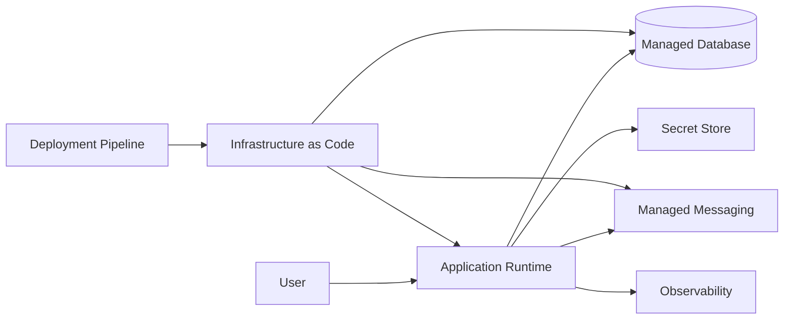

## Infrastructure as Code: l’infrastruttura è parte del comportamento del workload

Se il sistema dipende da compute, database, messaging, identity, networking, secret store e monitoring, la configurazione di queste capability non può vivere soltanto nella memoria di chi ha cliccato un portale. È parte dello stato intenzionale del software.

Creare manualmente una risorsa non è sempre sbagliato. In esplorazione, laboratorio o troubleshooting può essere il modo più veloce per imparare. Il problema nasce quando quel gesto diventa la source of truth della produzione. Da quel momento diventa difficile sapere che cosa sia configurato, perché, chi l’abbia cambiato, come differiscano gli ambienti e come ricostruire il sistema dopo un failure.

Questa è la forma operativa della configuration drift.

## IaC: rendere reviewable lo stato intenzionale

Infrastructure as Code porta la configurazione nel normale ciclo di engineering: versioning, diff, review, automazione e ripetibilità. Microsoft descrive Bicep come linguaggio dichiarativo per definire risorse Azure e distribuire infrastruttura coerente lungo il lifecycle.

Fonte:

- [Microsoft Learn — What is Bicep?](https://learn.microsoft.com/azure/azure-resource-manager/bicep/overview)

Il principio non dipende dallo strumento. Terraform, CloudFormation, CDK, Pulumi o Bicep possono essere scelte diverse per ottenere la stessa proprietà fondamentale:

> **l’infrastruttura significativa deve essere descritta come stato intenzionale versionato.**

## Dichiarativo non significa automaticamente sicuro

Un template IaC può rendere ripetibile anche una configurazione sbagliata. Restano da governare state, secret, parameter, destructive change, deployment ordering, privilege della pipeline, policy, drift e rollback.

Per questo l’IaC segue la stessa disciplina del codice: review, validation, test, promotion fra ambienti e change control proporzionato al rischio. Un `terraform plan` o un `bicep build` riuscito dimostra sintassi e una parte della coerenza, non la correttezza architetturale della topologia.

## Gli ambienti devono differire intenzionalmente

Dev, staging e production non hanno bisogno dello stesso costo né della stessa capacità. Development può usare SKU più piccoli, meno redundancy e retention ridotta; production può richiedere più capacity, backup e alerting più severi.

La proprietà importante è conservare lo stesso **architecture intent** e lo stesso deployment mechanism, rendendo esplicite le differenze attraverso parameter e policy. Environment parity non significa pagare in development la stessa HA della produzione; significa evitare quattro ambienti costruiti manualmente con quattro semantiche diverse.

## Il cloud non modifica automaticamente il deployment boundary

Nel Capitolo 8 abbiamo scelto un modular monolith. La disponibilità di container, function e subscription non ci obbliga a trasformare ogni modulo in una risorsa cloud distinta.

```text
modulo ≠ container ≠ service ≠ subscription
```

Questi boundary rispondono a problemi differenti. Il deployment boundary deve rimanere vicino al lifecycle reale del software finché un requisito non giustifica una separazione più forte.

## Cloud Deployment Map: dove il sistema diventa operabile

Introduciamo quindi un nuovo artefatto:

> **Cloud Deployment Map**

Non è l’inventario completo delle resource ID. È una vista decision-oriented che rende visibili runtime, state, messaging, identity, failure boundary, ownership, recovery e cost driver.

```markdown
# Cloud Deployment Map

## Workload

## Business outcome

## Environments

## Region / failure boundaries

## Compute

## State and data

## Messaging / integration

## Identity and secrets

## Networking

## Observability

## Deployment / IaC

## Ownership

## Recovery

## Cost drivers

## Open decisions

## Review triggers
```

Una vista grafica può aiutare:



Il diagramma acquista valore quando sappiamo anche chi possiede i componenti, quali identity attraversano i confini, quale stato deve essere recuperato e quale quality attribute giustifica ogni elemento.

## Context Map e Deployment Map raccontano cose diverse

L’Architecture Context Map racconta responsabilità e dipendenze del sistema. La Cloud Deployment Map racconta dove e come quelle responsabilità vengono operate. Il dominio può restare stabile mentre cambia il runtime cloud; allo stesso modo una nuova region non crea automaticamente un nuovo bounded context.

Tenere separate le due viste impedisce all’infrastruttura di riscrivere accidentalmente il modello del prodotto.

## La topologia deve avere una genealogia decisionale

Quando compare una nuova region, queue, identity, runtime o database, la Cloud Deployment Map dovrebbe ricondurci a una domanda: **quale requisito o failure mode ha causato questa risorsa?**

È il ponte fra ADR e deployment topology. Se una risorsa non ha una ragione comprensibile, potrebbe essere service sprawl o una decisione ereditata che merita review.

La reference architecture Azure mission-critical insiste sul provisioning ripetibile tramite IaC perché consistency e recovery dipendono dalla capacità di ricreare ambienti e scale unit in modo controllato.

Fonte:

- [Microsoft Learn — Mission-critical architecture on Azure](https://learn.microsoft.com/azure/architecture/reference-architectures/containers/aks-mission-critical/mission-critical-network-architecture)

Order Operations non copierà quella topologia: non ha lo stesso failure objective. Il principio trasferibile è che **quando la riproducibilità dell’infrastruttura entra nella recovery strategy, diventa una proprietà architetturale**.

## AI e IaC: più veloce da generare, non più semplice da possedere

Gli agenti possono creare Bicep, Terraform, policy, pipeline e Kubernetes manifest con grande velocità. Possono anche produrre configurazioni sintatticamente perfette che espongono una risorsa pubblicamente, assegnano permission eccessive, dimenticano backup, scelgono SKU sproporzionate o costruiscono una topologia che nessuno sa operare.

La review dell’IaC deve quindi verificare security, reliability, cost, operability, ownership e recovery, non soltanto la validità del template.

> **L’IaC rende l’infrastruttura codice. Non rende il codice automaticamente architettura corretta.**