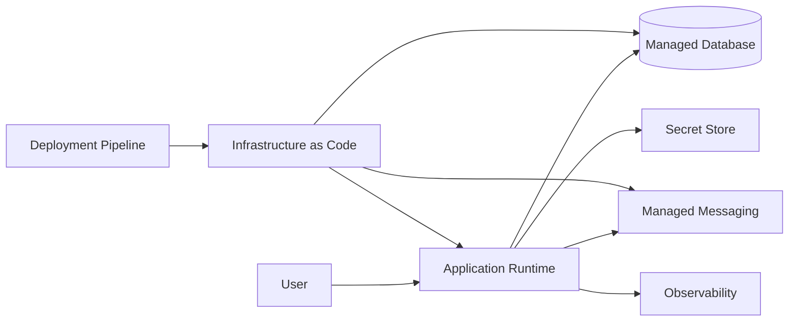

## Infrastructure as Code: l'infrastruttura è parte del software

Se il workload dipende da:

- compute;
- database;
- messaging;
- identity;
- networking;
- secret store;
- monitoring;

allora la configurazione di queste capability è parte del comportamento del sistema.

Non può vivere soltanto nella memoria di chi ha cliccato il portale.

## ClickOps come stato non riproducibile

Creare una risorsa manualmente non è sempre sbagliato.

Può essere utile per:

- esplorazione;
- spike;
- laboratorio;
- troubleshooting.

Il problema nasce quando la configurazione manuale diventa production source of truth.

In quel momento abbiamo difficoltà a sapere:

- che cosa è stato configurato;
- perché;
- chi lo ha cambiato;
- se dev/test/prod differiscono;
- come ricostruire l'ambiente;
- come revieware il cambiamento;
- come tornare indietro.

Questa è configuration drift.

## IaC come artefatto architetturale

Infrastructure as Code rende la configurazione:

- versionata;
- reviewable;
- ripetibile;
- diffabile;
- automatizzabile;
- collegabile alle decisioni.

Microsoft descrive Bicep come linguaggio dichiarativo per definire risorse Azure e distribuire la stessa infrastruttura in modo consistente nel lifecycle.

Fonte:

- [Microsoft Learn — What is Bicep?](https://learn.microsoft.com/azure/azure-resource-manager/bicep/overview)

Il principio è provider-independent.

Possiamo usare:

- Bicep;
- Terraform;
- CloudFormation;
- AWS CDK;
- Pulumi;
- altri strumenti.

La scelta dello strumento viene dopo la proprietà desiderata:

> **l'infrastruttura significativa deve essere descritta come stato intenzionale versionato.**

## IaC non è automazione completa

Avere un file Terraform o Bicep non significa che il workload sia automaticamente operabile.

Dobbiamo ancora gestire:

- secret;
- state;
- environment parameter;
- migration;
- deployment ordering;
- rollback;
- destructive changes;
- policy;
- drift;
- validation;
- privilege della pipeline.

Un template IaC può automatizzare anche un errore.

Quindi segue le stesse regole del codice:

- review;
- test;
- static validation;
- environment promotion;
- change control proporzionato al rischio.

## Environment: differenze intenzionali

Dev, test, staging e prod non devono essere necessariamente identici in capacità.

Sarebbe costoso e spesso inutile.

Dev può avere:

- SKU più piccolo;
- una instance;
- retention ridotta;
- meno capacity.

Prod può avere:

- maggiore redundancy;
- backup più robusto;
- scaling diverso;
- alert più severi.

Ma le differenze devono essere **esplicite**.

Quindi:

```text
same architecture intent
+ environment-specific parameters
```

non:

```text
quattro ambienti costruiti manualmente in quattro modi diversi
```

## Environment parity non significa cost parity

La proprietà importante è che ciò che testiamo rappresenti abbastanza bene ciò che deployiamo.

Per esempio:

- stesso runtime family;
- stessa modalità di autenticazione;
- stessa topologia logica;
- stesso message contract;
- stesse migration;
- stesso deployment mechanism.

Non serve che development paghi la stessa HA di production.

## Deployment unit

Nel Capitolo 8 abbiamo scelto un modular monolith.

Questo ha conseguenze anche sul cloud.

Non dobbiamo trasformare ogni modulo in una risorsa cloud distinta soltanto perché l'infrastruttura lo rende facile.

Il deployment boundary corrente resta vicino al lifecycle reale del software.

Questo è importante perché il cloud tende a spingerci verso una falsa equivalenza:

```text
modulo
=
container
=
service
=
subscription
```

Questa equivalenza non esiste.

I boundary hanno granularità diverse.

## Cloud Deployment Map

Introduciamo un nuovo artefatto operativo del libro:

> **Cloud Deployment Map**

Serve a rispondere a:

- dove gira il workload?
- quali managed service usa?
- quali failure boundary esistono?
- quali identity attraversano i boundary?
- quali dati sono stateful?
- quale team possiede cosa?
- come viene deployed?
- come viene osservato?
- come viene recuperato?

Non è un inventario completo di risorse.

È una vista decision-oriented.

## Template

```markdown
# Cloud Deployment Map

## Workload

## Business outcome

## Environments

## Region / failure boundaries

## Compute

## State and data

## Messaging / integration

## Identity and secrets

## Networking

## Observability

## Deployment / IaC

## Ownership

## Recovery

## Cost drivers

## Open decisions

## Review triggers
```

## Una vista grafica

Per esempio:



Questo diagramma da solo non basta.

Dobbiamo aggiungere almeno:

- failure boundary;
- ownership;
- identity;
- recovery;
- quality attribute che giustificano la topologia.

## Non confondere Cloud Deployment Map e Architecture Context Map

La Context Map risponde soprattutto a:

```text
chi interagisce con il sistema?
quali responsabilità e dipendenze esistono?
```

La Cloud Deployment Map risponde a:

```text
dove e come quelle responsabilità vengono operate nel cloud?
```

Lo stesso sistema può avere una Context Map stabile mentre cambia deployment topology.

Questa separazione evita di confondere dominio e infrastruttura.

## Deployment architecture come decision log

Se introduciamo:

- nuova region;
- nuova queue;
- nuovo database;
- nuovo runtime;
- nuovo private endpoint;
- nuova identity;

la mappa deve farci chiedere:

> quale requisito o failure mode ha causato questo cambiamento?

Questo è il ponte tra ADR e cloud topology.

## Real case — mission-critical architecture e IaC

La reference architecture Azure mission-critical raccomanda provisioning ripetibile tramite IaC e deployment automatizzati proprio perché consistency e recovery del workload dipendono dalla capacità di ricreare ambienti e scale unit in modo controllato.

Fonte:

- [Microsoft Learn — Mission-critical architecture on Azure](https://learn.microsoft.com/azure/architecture/reference-architectures/containers/aks-mission-critical/mission-critical-network-architecture)

Non copieremo quella reference architecture per Order Operations.

Il nostro workload non è mission-critical nello stesso senso.

Usiamo il caso per sostenere il principio:

> **quando l'infrastruttura diventa parte della strategia di reliability, la sua riproducibilità diventa una proprietà architetturale.**

## L'AI e l'Infrastructure as Code

Gli agenti possono generare molto velocemente:

- Terraform;
- Bicep;
- CloudFormation;
- Kubernetes manifest;
- policy;
- pipeline.

Questo è utile.

Ma aumenta un rischio.

Un agente può produrre infrastruttura sintatticamente valida che:

- espone una risorsa pubblicamente;
- usa SKU sproporzionate;
- dimentica backup;
- crea permission eccessive;
- apre egress non necessario;
- abilita retention sbagliata;
- costruisce una topologia che nessuno sa operare.

La review dell'IaC deve quindi verificare almeno:

```text
security
reliability
cost
operability
ownership
rollback/recovery
```

non soltanto:

```text
terraform plan succeeds
```

> **L'IaC rende l'infrastruttura codice. Non rende il codice automaticamente architettura corretta.**