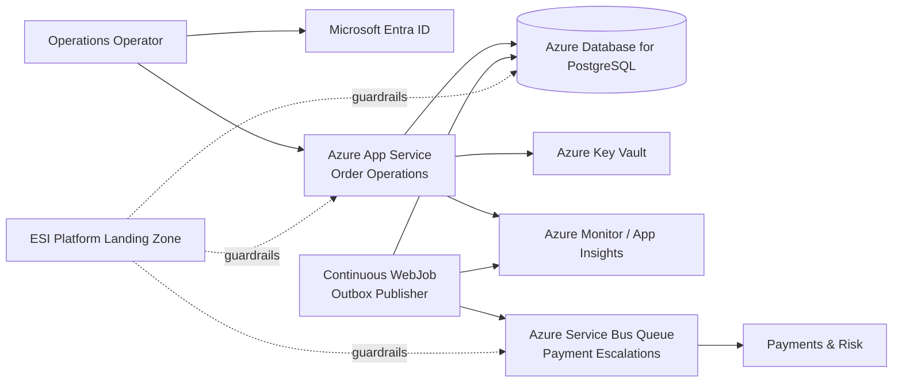

## ESI — Order Operations entra nel cloud

> **Scenario fittizio/composito.** ESI, requisiti, persone e decisioni specifiche sono simulati. Le proprietà dei servizi cloud citati sono invece confrontate con documentazione ufficiale.

Siamo finalmente nella posizione di scegliere una deployment topology concreta per Order Operations.

Non partiamo dal catalogo Azure.

Partiamo dallo stato del workload.

## Stato corrente

Order Operations è:

- un prodotto interno di Commerce & Operations;
- un modular monolith;
- scritto inizialmente in TypeScript;
- supportato da PostgreSQL;
- dotato di transactional outbox;
- produttore di `PaymentEscalation` verso Payments & Risk;
- ancora privo di un requisito multi-region;
- posseduto da un singolo workload team;
- soggetto ai guardrail della landing zone ESI.

I componenti applicativi sono oggi:

```text
HTTP API
Outbox Publisher
PostgreSQL
Message channel verso Payments & Risk
```

## Nuovo vincolo organizzativo

Platform Engineering mette a disposizione una **Azure application landing zone** con:

- Microsoft Entra ID;
- policy baseline;
- networking enterprise;
- Azure Monitor / logging integration;
- Key Vault;
- managed identity;
- Infrastructure as Code tramite Bicep come percorso supportato;
- cost allocation/tagging baseline.

Questa è una foundation.

Non è la soluzione applicativa.

## Compute candidates

Valutiamo quattro candidati.

### VM

Comprerebbe massimo controllo.

Ma Order Operations non richiede:

- custom OS;
- privileged daemon;
- software di sistema speciale;
- controllo host.

Costo:

- patching e lifecycle maggiori;
- più automation infrastrutturale;
- maggiore superficie operativa.

**Decisione: no.**

### AKS

Comprerebbe orchestration e configurabilità.

Ma non abbiamo:

- molti servizi indipendenti;
- scheduler requirement;
- service mesh requirement;
- team Kubernetes dedicato;
- necessità di cluster-level extensibility.

**Decisione: no.**

### Azure Container Apps

È un candidato credibile.

Offre container hosting gestito con scaling e astrazione dall'orchestrazione.

Potrebbe diventare interessante se:

- API e worker richiedessero scaling molto diverso;
- container portability diventasse importante;
- il workload si frammentasse in più componenti indipendenti.

Ma oggi containerizzare il progetto aggiungerebbe una decisione che non risolve ancora un requisito.

**Decisione: non ancora.**

Fonte per il confronto:

- [Microsoft Learn — Choose an Azure container service](https://learn.microsoft.com/azure/architecture/guide/choose-azure-container-service)

### Azure App Service

Il workload è una web/API application tradizionale con un background publisher strettamente correlato.

App Service è un PaaS managed per web application e API.

Per il background publisher possiamo usare inizialmente un **continuous WebJob**, perché:

- viene gestito insieme all'applicazione;
- non richiede scaling indipendente;
- esegue un task continuo;
- non abbiamo ancora bisogno di trigger serverless dedicati.

Microsoft descrive WebJobs come un buon fit proprio quando l'applicazione è già ospitata su App Service e il background task può essere deployed e managed insieme, senza un modello di scaling indipendente.

Fonte:

- [Microsoft Learn — App Service WebJobs overview](https://learn.microsoft.com/azure/app-service/overview-webjobs)

**Decisione corrente: Azure App Service + continuous WebJob.**

## Perché questa scelta è importante

È poco spettacolare.

Ed è proprio per questo che è utile.

Non stiamo costruendo:

```text
AKS
+ service mesh
+ 5 microservices
+ autoscaler multipli
+ distributed tracing perché abbiamo distribuito tutto
```

Stiamo scegliendo una PaaS topology coerente con il deployment boundary che avevamo già deciso.

> **Il cloud non deve costringerci a cambiare architettura soltanto per sembrare cloud.**

## Database

Il datastore corrente resta PostgreSQL.

Quindi scegliamo:

> **Azure Database for PostgreSQL Flexible Server**

perché mantiene il modello PostgreSQL già deciso e delega una parte del lifecycle operativo alla piattaforma.

La configurazione iniziale sarà single-region.

Backup e recovery sono obbligatori.

La decisione finale fra configurazione zonal e zone-redundant production HA verrà legata ai target quantitativi di availability/RTO/RPO che ancora dobbiamo chiudere.

Non useremo `multi-region active-active` per default.

Fonti:

- [Microsoft Learn — Azure Database for PostgreSQL](https://learn.microsoft.com/azure/postgresql/overview)
- [Microsoft Learn — Azure Database for PostgreSQL high availability](https://learn.microsoft.com/azure/postgresql/high-availability/concepts-high-availability)

## Messaging

Il flusso corrente è:

```text
Order Operations
→ Payment Escalation
→ Payments & Risk
```

Abbiamo un consumer principale e un intento point-to-point.

Quindi scegliamo inizialmente:

> **Azure Service Bus Queue**

non un topic.

La documentazione Microsoft distingue queue per point-to-point e topic/subscription per publish-subscribe one-to-many.

Fonte:

- [Microsoft Learn — Service Bus queues, topics and subscriptions](https://learn.microsoft.com/azure/service-bus-messaging/service-bus-queues-topics-subscriptions)

Se domani la stessa semantica dovrà essere consumata indipendentemente da:

```text
Payments & Risk
Audit
Analytics
Fraud
```

rivaluteremo una pub/sub topology o event distribution distinta.

Non anticipiamo quattro consumer che oggi non esistono.

## Identity e secrets

### Runtime identity

App Service usa managed identity per accedere alle capability Azure che supportano l'autenticazione Entra/RBAC.

### Secret esterni

Le credenziali inevitabili verso provider esterni vengono conservate in Key Vault.

### No secret nel repository

`appsettings`, `.env` o file equivalenti non devono contenere secret production committed.

### Separate identity

La pipeline di deployment non usa automaticamente la stessa identity runtime dell'applicazione.

Questa separazione riduce blast radius.

## Observability

Order Operations entra nella piattaforma di osservabilità ESI.

La Cloud Deployment Map include:

- application logs;
- metrics;
- dependency telemetry;
- outbox backlog;
- oldest unpublished message age;
- payment escalation delivery latency;
- Service Bus DLQ count;
- database health;
- App Service health.

Non definiamo ancora tutto il modello di observability.

Il Capitolo 15 lo farà in profondità.

Ma il cloud deployment non può nascere completamente cieco.

## Deployment topology corrente



Il diagramma non mostra ancora ogni network resource.

È intenzionale.

Mostra ciò che serve alla decisione corrente.

## Ownership

### Platform Engineering

Possiede:

- landing zone foundation;
- policy baseline;
- enterprise identity foundation;
- shared observability foundation;
- approved IaC path;
- shared network capabilities.

### Order Operations team

Possiede:

- App Service configuration del workload;
- PostgreSQL sizing e schema;
- Service Bus entity necessaria al workflow;
- application identity scope;
- deployment;
- runtime configuration;
- NFR;
- cost del workload;
- failure handling;
- on-call applicativo.

### Payments & Risk

Possiede:

- consumer semantics;
- economic processing;
- idempotency economica;
- decisioni downstream relative al pagamento.

## Il compromesso

### Esigenza

Deployare rapidamente un workload production-capable dentro gli standard ESI.

### Tensione

```text
Platform standardization
vs
team autonomy
vs
operational simplicity
vs
future scaling flexibility
vs
cost
```

### Decisione

```text
Azure application landing zone
+ App Service
+ continuous WebJob
+ Azure Database for PostgreSQL
+ Service Bus Queue
+ managed identity
+ Key Vault
+ Azure Monitor/App Insights
+ Bicep
+ single region
```

### Costo accettato

- maggiore coupling operativo ad Azure;
- API e publisher condividono ancora lo stesso lifecycle infrastrutturale;
- niente independent scaling del publisher;
- niente regional failover immediato;
- minore configurabilità rispetto ad AKS.

### Quality floor

Non negoziamo:

- durable escalation intent;
- idempotency;
- managed secret handling;
- identity separata e least privilege;
- backup/recovery;
- observability del delivery path;
- Infrastructure as Code;
- ownership applicativa.

### Guardrail

- Cloud Deployment Map;
- Failure Mode Map;
- Bicep versionato;
- budget/cost review;
- workload identity;
- backup/restore test;
- outbox telemetry;
- architecture review trigger.

### Trigger di revisione

Rivalutare compute/topology se:

- API e publisher richiedono scaling significativamente differente;
- WebJob interfere con latency o capacity dell'API;
- servono più background workload indipendenti;
- il workload diventa container-first per motivi reali;
- una capability richiede isolation più forte;
- RTO/RPO richiedono multi-zone/multi-region diverso;
- Service Bus queue non rappresenta più il consumer model;
- il costo PaaS non ha più fit rispetto al workload.

## Real case vs ESI

La scelta ESI è simulata.

Non sosteniamo che App Service sia sempre migliore di Kubernetes o serverless.

Il caso dacadoo discusso prima mostra proprio l'opposto: una architettura può attraversare VM, Kubernetes e serverless quando il contesto evolve.

La lezione comune è:

> **la piattaforma giusta è quella che riduce il lavoro non differenziante senza sottrarci il controllo che il problema ci obbliga realmente ad avere.**