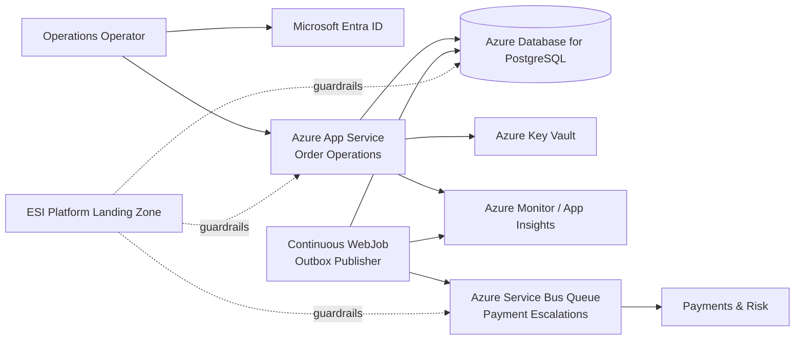

## ESI — Order Operations entra nel cloud

> **Scenario fittizio/composito.** ESI, requisiti e decisioni specifiche sono simulati. Le proprietà dei servizi cloud citati vengono invece confrontate con documentazione ufficiale.

Siamo finalmente nella posizione di scegliere una deployment topology concreta. Il punto importante è che arriviamo qui dopo aver già deciso dominio, topology applicativa, data ownership, API contract e primo flusso asincrono. Il cloud deve servire quel sistema, non ridisegnarlo soltanto perché il catalogo offre più primitive.

Order Operations è un modular monolith TypeScript con HTTP API, outbox publisher, PostgreSQL e un channel di Payment Escalation verso Payments & Risk. È posseduto da un unico workload team, non ha ancora un requisito multi-region quantitativo e vive dentro i guardrail della landing zone ESI.

## Azure è un constraint organizzativo del caso

Platform Engineering mette a disposizione una Azure application landing zone con Microsoft Entra ID, policy, networking enterprise, logging/monitoring foundation, Key Vault, managed identity, un percorso IaC supportato con Bicep e cost allocation standard. Questa foundation riduce il numero di decisioni che Order Operations deve reinventare, ma non decide il runtime applicativo al posto del team.

La domanda rimane: **quale topologia cloud soddisfa il workload corrente con la minore ownership non necessaria?**

## Compute: eliminare il controllo che non ci serve

Una VM ci darebbe controllo su OS e host che il workload non richiede, aumentando patching e lifecycle ownership. AKS comprerebbe orchestration, cluster extensibility e policy avanzate che un’API e un publisher strettamente correlati non sanno ancora sfruttare. Azure Container Apps è un candidato credibile se in futuro API e worker avranno scaling profile differenti o se la container portability diventerà un requisito, ma containerizzare oggi il modular monolith non risolve un problema osservato.

Fonte per il confronto:

- [Microsoft Learn — Choose an Azure container service](https://learn.microsoft.com/azure/architecture/guide/choose-azure-container-service)

Azure App Service ha invece un fit naturale con la web/API application corrente. Per l’outbox publisher scegliamo inizialmente un **continuous WebJob**, perché il task è continuo, condivide ancora il lifecycle applicativo e non richiede scaling indipendente. Microsoft descrive WebJobs proprio come un’opzione adatta quando background task e App Service possono essere deployed e managed insieme.

Fonte:

- [Microsoft Learn — App Service WebJobs overview](https://learn.microsoft.com/azure/app-service/overview-webjobs)

La decisione di compute è quindi volutamente poco spettacolare:

> **Azure App Service + continuous WebJob.**

La semplicità è una proprietà comprata, non una mancanza di ambizione.

## Database: mantenere il modello già giustificato

Il Capitolo 10 ha scelto PostgreSQL per ragioni di data model e access pattern. Il cloud non crea un motivo per cambiare database. Usiamo quindi **Azure Database for PostgreSQL Flexible Server**, delegando parte del lifecycle operativo senza cambiare semantic ownership e modello applicativo.

La baseline resta single-region. Backup e recovery sono obbligatori; la configurazione production HA più appropriata verrà legata ai target quantitativi di availability, RTO e RPO man mano che saranno definiti.

Fonti:

- [Microsoft Learn — Azure Database for PostgreSQL](https://learn.microsoft.com/azure/postgresql/overview)
- [Microsoft Learn — Azure Database for PostgreSQL high availability](https://learn.microsoft.com/azure/postgresql/high-availability/concepts-high-availability)

Non introduciamo active-active multi-region prima di avere un failure objective che ne paghi la complessità.

## Messaging: il consumer model decide queue o topic

Il flusso attuale ha un producer e un dominio responsabile della presa in carico: Order Operations invia una Payment Escalation a Payments & Risk. Per questo una **Azure Service Bus Queue** rappresenta meglio la semantica point-to-point di oggi rispetto a un topic pub/sub.

Fonte:

- [Microsoft Learn — Service Bus queues, topics and subscriptions](https://learn.microsoft.com/azure/service-bus-messaging/service-bus-queues-topics-subscriptions)

Se in futuro audit, analytics o fraud diventeranno consumer indipendenti dello stesso fatto, rivaluteremo il modello. Non creiamo adesso una topologia one-to-many per consumer che non esistono.

## Identity e secrets seguono il principio di blast radius

Il runtime App Service usa managed identity verso le capability Azure compatibili. I secret inevitabili di provider esterni vivono in Key Vault. Nessun production secret viene committato in `.env`, appsettings o file equivalenti. La deployment identity rimane distinta dalla runtime identity, così la capacità di modificare l’infrastruttura non coincide automaticamente con i permessi dell’applicazione.

La semantica authorization verso gli operatori resta del workload anche se l’autenticazione si appoggia a Entra ID.

## Il deployment deve nascere osservabile

Il Capitolo 15 definirà in profondità l’observability model, ma una topologia production-capable non può partire cieca. La baseline include application log e metriche, dependency telemetry, health del runtime e del database e soprattutto i segnali del flusso distribuito già introdotto: outbox backlog, oldest unpublished message age, Payment Escalation delivery latency e Service Bus DLQ.

Il cloud monitoring non sostituisce la Failure Mode Map; la rende osservabile.

## La baseline del Capitolo 12

La decisione può essere riassunta così:

```text
Azure application landing zone
+ Azure App Service
+ continuous WebJob
+ Azure Database for PostgreSQL Flexible Server
+ Azure Service Bus Queue
+ managed identity
+ Azure Key Vault
+ Azure Monitor / Application Insights foundation
+ Bicep
+ single Azure region
```

Il diagramma corrente mostra soltanto ciò che il Capitolo 12 ha già deciso:



Non mostra ancora ogni private endpoint, ingress control o recovery target. È intenzionale: quelle decisioni matureranno nei capitoli Security e Reliability.

## Ownership: la piattaforma non prende il prodotto in carico

Platform Engineering possiede landing zone, policy, identity foundation, network/shared observability capability e il percorso IaC approvato. Order Operations continua a possedere runtime configuration, PostgreSQL schema e sizing, Service Bus entity del proprio workflow, NFR, deployment, failure handling, cost e on-call applicativo. Payments & Risk possiede consumer semantics e qualunque processo economico downstream.

Il modello di responsabilità rimane quindi coerente con il boundary del capitolo: Platform riduce cognitive load senza diventare owner del workload.

## Il compromesso

Con questa topologia accettiamo maggiore coupling operativo ad Azure, nessun scaling completamente indipendente del publisher, nessun regional failover immediato e minore configurabilità rispetto ad AKS. In cambio otteniamo un runtime e servizi dati/messaging gestiti, integrati nella foundation aziendale, senza introdurre cluster o deployment boundary non richiesti.

Il quality floor rimane durable escalation intent, idempotency, managed secret handling, least privilege, backup/recovery, observability del delivery path, Infrastructure as Code e ownership applicativa.

Rivaluteremo compute e topology se API e publisher divergeranno significativamente nel profilo di scaling, se il WebJob interferirà con latency/capacity dell’API, se nasceranno worker indipendenti, se container portability o isolation diventeranno requisiti, se RTO/RPO richiederanno un’altra regional strategy oppure se il consumer model non sarà più point-to-point.

## Baseline narrativa e snapshot vivo

L’ADR del capstone che conserva questa decisione è:

```text
capstone/example-software-industries/products/order-operations/docs/adr/0002-azure-paas-single-region.md
```

La Cloud Deployment Map cumulativa è:

```text
capstone/example-software-industries/products/order-operations/docs/cloud-deployment.md
```

Quel documento vivo prosegue oltre il Capitolo 12 e incorpora decisioni dei Capitoli 13–14, come private ingress, zone redundancy e Reliability Contract più quantitativo. Il manoscritto conserva invece la baseline e il reasoning disponibili **in questo punto della storia**. Non riportiamo indietro il progetto per far coincidere artificialmente snapshot cumulativo e capitolo precedente.

La lezione del caso resta indipendente da Azure:

> **la piattaforma giusta riduce il lavoro non differenziante senza sottrarci il controllo che il problema ci obbliga realmente ad avere.**